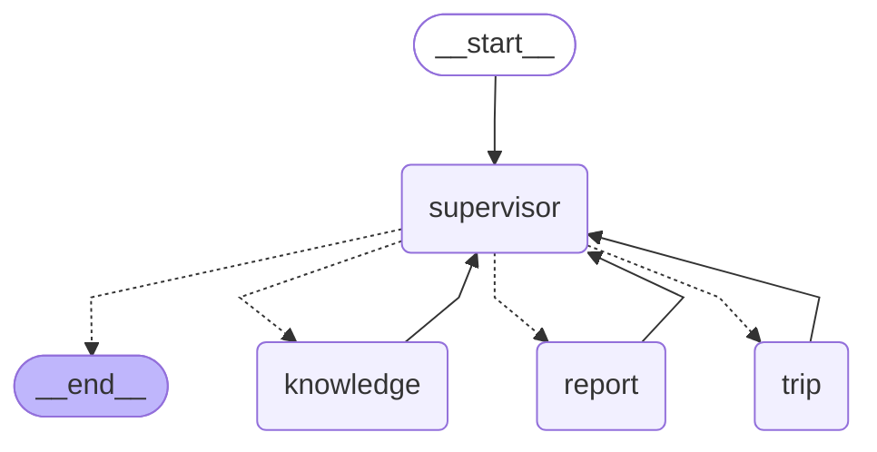

# Chat — Agentic RAG + Harness 演進方向

> 建立時間：2026-06-06 ／ 最後更新：2026-07-10
> 背景：朋友建議 RAG 要走 agentic，並在 pipeline 末端加 harness 穩定品質。

---

## 現況（已實作）：LangGraph 分層 multi-agent（取代單一 flat agent）

> 2026-06-14 版本曾決定「不引入 LangGraph、自製即可」，本次（2026-07-10）**有意識推翻**這個結論：
> 單一 agent 攤平掛 9 個工具後 prompt 越來越肥、路由/內容生成/領域規則全部擠在一顆 prompt 裡，
> 改用組織架構式的分層 supervisor + sub-agent 更容易維護與擴充。

原本「單一 LLM 原生 tool calling 迴圈」（`agentic_chat_stream`，攤平掛 `search`/`create_report`/
`create_trip`/... 9 個工具）已被取代，改為 **A（監督者）→ B/C/D（領域窗口）** 的垂直分層架構：

```
用戶訊息
  → A（supervisor，持有完整對話歷史）
      判斷要不要派工，一次派一個窗口，事件敘述需自足（B/C/D 看不到對話歷史）
      ├─ B knowledge   查找 / 存入知識庫（search、save_url）
      ├─ C report      產出 / 修改 / 查詢 AI 報告
      └─ D trip        規劃 / 修改 / 查詢旅遊行程
      派給 C／D 時，A 綜合「整個對話歷史」（不只最近一輪）篩選出真正有用的知識 item_ids，
      只帶 id；把 id 換成完整 items/chunks（欄位不裁切）這件事由程式碼
      （_build_knowledge_index / _resolve_dispatch_context）處理，不經過 LLM 轉述避免失真
      窗口回報「缺什麼」時，A 自行判斷：問用戶 / 轉發給 B 查 / 自己推斷補上
  → A 判斷是否收工，收工前用 streaming 回覆用戶
      （emit: tool_call | tool_result | sources | report_draft | trip_draft | delta | done，SSE 協議不變）
  → 存訊息（process_log 同時保留 steps 給前端顯示、dispatches 給下一輪歷史回放用）；每 8 則於背景壓縮 context_summary
```

### Graph 結構（直接從 `build_graph()` 產生，不是手畫）



改了 `graph/supervisor.py` 的節點/邊之後，用下面指令重新產生貼回這裡（虛線＝條件邊，實線＝固定邊）：

```bash
cd apps/api && uv run python -c "from app.services.ai_service.graph import build_graph; print(build_graph().get_graph().draw_mermaid())"
```

B/C/D 各自是完整的多步驟 sub-agent：內部可自行多次呼叫底層工具換角度重試（例如 B 換角度重新
`search`），不需要每次都回報 A；只有真的做不下去時才呼叫 `report_missing_info` 收工，把「缺什麼」
交回給 A。**Reflect & Re-retrieve 由各窗口自己的原生 tool calling 吸收**，不需要手寫「評估 → 重試」。

**踩過的坑**：
- `chat_service._build_history` 一開始只回放「最近一輪」的派工紀錄，導致 A 派給 C/D 時看不到更早以前
  B 查到的知識、C/D 收到空 context 回報 `needs_input`，A 又不會處理這個信號、直接輸出「請稍候」的
  假回覆卡住。已改成回放**全部**歷史派工紀錄，讓 A 有本錢「綜合整個對話歷史」判斷。
- Gemini 串流最後一個 chunk（`finish_reason=STOP`）常常 `candidates[0].content.parts` 直接是 `None`
  （不是空 list），舊寫法 `chunk.candidates[0].content.parts if chunk.candidates else []` 只檢查
  `candidates` truthy，沒防到這層，會丟 `TypeError: 'NoneType' object is not iterable`。已在
  `_client.py` 加 `_chunk_parts(chunk)` 防呆並取代所有呼叫點（含 `ai_service/chat.py`、`tools.py`）。

### 相關檔案

| 檔案 | 說明 |
|------|------|
| `apps/api/app/services/chat_service.py` | `stream_reply`：session 載入、preload、三個窗口的 domain executor（DB/embedding/建立 item）、消費 graph 的 astream、存訊息、context 壓縮 |
| `apps/api/app/services/ai_service/graph/state.py` | `GraphState`：A 的 messages/round/dispatch_* 等可序列化狀態 |
| `apps/api/app/services/ai_service/graph/emit.py` | `emit()`：用 `stream_mode="custom"` 即時推流，讓窗口內工具執行中就能送出 SSE |
| `apps/api/app/services/ai_service/graph/supervisor.py` | A：dispatch 工具宣告、路由 prompt、`build_graph()`（StateGraph + 條件邊 + 迴圈） |
| `apps/api/app/services/ai_service/graph/windows/knowledge.py` | B：search / save_url |
| `apps/api/app/services/ai_service/graph/windows/report.py` | C：create_report / revise_report / search_reports |
| `apps/api/app/services/ai_service/graph/windows/trip.py` | D：create_trip / add_trip_card / revise_trip / search_trips |
| `apps/api/app/services/ai_service/graph/windows/_loop.py` | B/C/D 共用的窗口內迴圈骨架（含 `report_missing_info` 缺資訊收工機制） |
| `apps/api/app/crud/chat.py` | 訊息存取、context_summary |

---

## 待實作：Harness 評估層（Response Quality Gate）

> 狀態：**尚未實作**。與編排方式無關——它評估的是「輸出品質」，原生 tool calling 下一樣適用。

目的：抓 hallucination / 無根據作答 / 答非所問，作為**可觀測性與護欄**，不是編排。

> ⚠️ 原生 tool calling + 良好 prompt 已把亂編風險壓低。**建議實際觀察到品質問題、或樣本累積到一定量再做**，否則屬 premature optimization。

### 設計（背景執行，不阻塞 streaming）

```
stream_reply 完成
  → background_tasks 丟一個輕量 LLM eval（haiku 級，timeout ~2s）
      - 回覆是否有根據 sources？
      - 是否直接回答了用戶問題？
      - 產出 quality_score（0–1）+ flags（hallucination / off-topic / no_evidence）
  → 結果寫入 chat_messages.process_log 的 harness 欄位（先純觀測）
  → 累積數據後再決定是否加「低分觸發重生成」
```

### 最小實作草案

```python
# app/services/chat_harness.py
async def eval_response(user_query: str, sources: list[dict], reply: str) -> dict:
    """輕量品質評估，回傳 quality_score 和 flags。用 haiku / flash 模型。"""
    ...

# chat_service.py，stream_reply 末端：
background_tasks.add_task(
    _run_harness_eval, message_id, user_content, sources_json, reply_text
)
```

### 技術選型

| 元件 | 建議 |
|------|------|
| Eval 方式 | 輕量 LLM call（haiku / flash 級，速度快成本低） |
| 評估時機 | 背景任務（不影響 streaming 延遲，結果記在 `process_log`） |
| Agentic 框架 | LangGraph（`graph/supervisor.py` 的 StateGraph）：A 的路由/迴圈用 graph 表達；B/C/D 內部迴圈仍是一般 async 函式，不是巢狀 subgraph |
